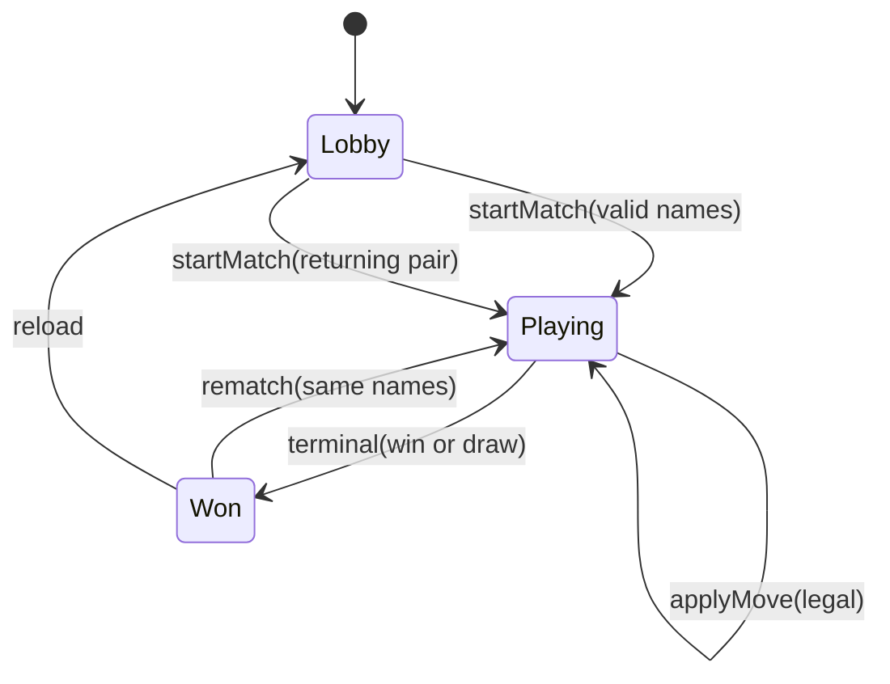

# feat: MetaToe Playable MVP

## Summary

Scaffold a Vite + React + Vitest app at the repo root that implements the full brainstorm vertical slice: lobby with rival names, pass-and-play ultimate tic tac toe on the MetaToe visual design, motion-first feedback, terminal moment (win or draw) with rematch-only loop, and browser-local session metrics. Pure game logic and persistence modules are built test-first; UI ports CSS and layout from `design-system/MetaToe.html` while importing tokens from `design-system/styles/colors_and_type.css`.

---

## Problem Frame

Friends pass-and-play on one device lack a polished digital option for ultimate tic tac toe and default to pen and paper. v1 is a bet to prove the event-feeling aesthetic wins over paper — see origin for full problem frame and persona.

---

## Requirements

- R1. Ultimate tic tac toe rules (nine local boards, sent-to targeting, meta wins)
- R2. Legal move enforcement with free-board fallback when sent-to board is won/full
- R3. Local board wins, drawn local boards, match victory, and match-level draws
- R4. Invalid moves blocked with clear feedback; state unchanged
- R5. Lobby display names for both rivals; names in turn banner and win moment
- R6. Win moment naming winner or draw; decisive framing
- R7. Immediate rematch with same names; no lobby return
- R8. Local name-pair memory for 7-day return recognition
- R9. Visual design aligned to `design-system/MetaToe.html` and token CSS
- R10. Motion feedback on moves and wins; sound optional
- R11. Track match terminal resolution (started → win, draw, or abandoned) for session bookkeeping; **strategy match-completion rate** (per STRATEGY.md) counts only `outcome === win` (origin wording: "declared winner")
- R12. Track immediate rematch after a terminal match (win or draw) in the same session — excludes abandoned
- R13. Track 7-day rivalry return when same pair starts a new match

**Origin actors:** A1 (Rival X), A2 (Rival O)

**Origin flows:** F1 (Start a rivalry match), F2 (Rematch the same rivalry), F3 (Return after days away)

**Origin acceptance examples:** AE1 (illegal board), AE2 (free move), AE3 (meta win), AE4 (rematch), AE5 (7-day return)

---

## Scope Boundaries

- Classic 3×3 mode, online/async multiplayer, production deploy/PWA
- User accounts, cloud sync, running score across rematches
- During an active session (`playing` or rematch loop), rivals cannot change names or return to lobby without full reload; reload from terminal screen is the only path to new pairings
- Nav stats panel live data beyond move count (static placeholders OK for v1)
- Sound as required behavior (stub allowed)
- In-app analytics dashboard (console export or minimal `?dev=1` readout is enough for v1)

### Deferred to Follow-Up Work

- Production deployment and hosting configuration
- Sound implementation beyond no-op stub (`src/sound.js`)
- Persist in-progress match across page refresh (v1: reload → lobby)
- `design-system/MetaToe.html` as a live CDN preview kept in sync with app (optional static reference is sufficient for v1)

---

## Context & Research

### Relevant Code and Patterns

- `design-system/MetaToe.html` — authoritative layout, class names (`turn-banner`, `lobby`, `move-row`, `meta-mini`), keyframes (`mt-snap`, `mt-board-won`, `mt-pop`, `mt-confetti`, `mt-row-in`)
- `design-system/styles/colors_and_type.css` — design tokens (`--magenta`, `--cyan`, `--dur-std`, etc.)
- `design-system/assets/` — logos and token SVGs
- `STRATEGY.md` — three tracks (presentation, rules engine, rivalry ritual) and three metrics
- Repo is greenfield: no `package.json`, no `src/`, referenced `design-system/src/*` modules do not exist — **board/cell markup and playable JSX are not in the checked-in mockup**; implementers must define board DOM/CSS from mockup tokens + requirements (see U5)

### Institutional Learnings

- None in `docs/solutions/`

### External References

- Standard ultimate tic tac toe rules (opening move anywhere; sent-to thereafter; drawn local boards block meta lines)

---

## Key Technical Decisions

- **Vite + React at repo root** (not CDN-in-browser): enables Vitest, npm scripts, and TDD workflow required by project policy; imports design-system CSS/assets via relative paths (see origin deferred question on app structure).
- **Pure `gameLogic` module**: no DOM/React in rules layer; UI calls `getLegalMoves`, `applyMove`, `getResult` (see origin: rules engine track).
- **React `useReducer` for match phase**: single app state machine `lobby | playing | won` with game state nested under `playing`/`won`. Phase `won` means **any terminal outcome** (win or draw) — check `outcome` for variant UX, not phase name alone.
- **Canonical rivalry pair key**: `sort([normalize(nameA), normalize(nameB)])` where normalize = trim, collapse whitespace, case-fold — so order of entry does not break F3 (flow analysis C2).
- **Draw is a first-class terminal outcome**: terminal moment shows draw variant (amber `.turn-banner.done`); rematch allowed after draw.
- **Metrics split**: `terminalResolutionRate` (any win/draw/abandoned) vs `winCompletionRate` (STRATEGY match-completion rate, win only).
- **Refresh = new session**: no mid-match persistence in v1; reload returns to lobby.
- **Rematch**: same X/O sides; X opens each new match; rematch CTA on **terminal screen** (`won` phase, win or draw); "New session" = full page reload.
- **Lobby side assignment**: left name field = X/magenta, right = O/cyan; hide `lobby-pick` mode grids (ultimate-only MVP; see origin Key Decision).
- **Metrics in localStorage** with injectable storage adapter for tests; dev inspection via `?dev=1` tweaks panel or console export (see origin deferred question on metrics storage).
- **Motion v1 set**: token placement (`mt-snap`), local board win emphasis (`mt-board-won`), win moment entrance (`mt-pop`), moves log row (`mt-row-in`); respect `prefers-reduced-motion`.

---

## Open Questions

### Resolved During Planning

- **App structure (origin deferred):** Vite app at repo root consuming `design-system/` tokens; port inline CSS from `MetaToe.html` into importable app CSS.
- **Motion scope (origin deferred):** Four motion moments above; confetti optional on win only; reduced-motion fallback required.
- **Metrics storage (origin deferred):** `localStorage` keys under `metatoe/` namespace; unit tests use in-memory adapter.
- **Match draw UX:** Draw win moment + rematch allowed (flow analysis Q1).
- **7-day window:** 168 hours from `lastPlayedAt` (flow analysis Q6).
- **Lobby side assignment:** Hide `lobby-pick` mode grids; left field = X, right = O (origin: ultimate-only).

### Metrics event contract

| Event | Emitted by | When |
|-------|------------|------|
| `match_started` | U4 (lobby start), U6 (rematch) | New match begins |
| `match_completed` | U6 | Terminal win or draw; abandoned on reload mid-match (v1 instrumentation) |
| `rematch_started` | U6 | Rematch after terminal match |
| `rivalry_return` | U4 | Lobby start when pair recognized within 168h (AE5) |
| `lastPlayedAt` update | U6 | On terminal outcome |

U3 implements the module and rollups; U4/U6 own emit calls.

### Deferred to Implementation

- Exact copy strings for win/draw moment and invalid-move hints — derive from design tone during UI pass.
- Whether confetti runs on draw as well as win — default win-only unless design review says otherwise.

---

## Output Structure

```text
talk-practice/
├── package.json
├── vite.config.js
├── vitest.config.js
├── index.html
├── src/
│   ├── main.jsx
│   ├── App.jsx
│   ├── Lobby.jsx
│   ├── components/
│   │   ├── NavBar.jsx           # logo + title from mockup
│   │   ├── GameShell.jsx        # 3-column layout (side panels + center)
│   │   ├── SidePanel.jsx        # stats (move count live; rest placeholder) + help copy
│   │   ├── MetaBoard.jsx        # 9 local boards — markup not in mockup; implement from tokens
│   │   ├── MetaMinimap.jsx      # `.meta-mini` grid in mockup
│   │   ├── TurnBanner.jsx
│   │   ├── MovesLog.jsx
│   │   └── TerminalMoment.jsx   # win or draw; was WinMoment.jsx
│   ├── game/
│   │   ├── gameLogic.js
│   │   └── gameLogic.test.js
│   ├── session/
│   │   ├── rivalryStorage.js
│   │   ├── rivalryStorage.test.js
│   │   ├── metrics.js
│   │   └── metrics.test.js
│   ├── sound.js
│   ├── styles/
│   │   └── app.css
│   └── dev/
│       └── DevMetricsPanel.jsx
├── design-system/          # unchanged role: tokens, assets, reference HTML
└── docs/plans/...
```

---

## High-Level Technical Design

> *This illustrates the intended approach and is directional guidance for review, not implementation specification. The implementing agent should treat it as context, not code to reproduce.*



**Layering:**

```text
UI (React) → gameLogic (pure) → board state
           → session/metrics → storage adapter → localStorage
           → session/rivalryStorage → pair recognition (F3)
```

---

## Implementation Units

### U1. Project scaffold and design imports

**Goal:** Runnable local dev app with Vitest wired; design tokens and assets reachable from React.

**Requirements:** Enables all units; supports R9 foundation

**Dependencies:** None

**Files:**
- Create: `package.json`, `vite.config.js`, `vitest.config.js`, `index.html`, `src/main.jsx`, `src/styles/app.css`, `src/App.jsx` (minimal shell)
- Test: `src/smoke.test.js` (optional sanity that vitest runs)

**Approach:**
- Vite + React 18; Vitest with `environment: 'jsdom'` only where needed (prefer node for pure modules)
- Import `design-system/styles/colors_and_type.css` in `main.jsx`
- Port structural layout CSS from `design-system/MetaToe.html` `<style>` into `src/styles/app.css` (keep class names stable)
- Reference assets from `design-system/assets/` via Vite static import or public dir symlink/copy — prefer import paths that keep design-system as source of truth
- npm scripts: `dev`, `test`, `build`

**Execution note:** Add Vitest harness before any feature code per TDD policy.

**Patterns to follow:**
- `design-system/MetaToe.html` class naming (`mt-btn`, `turn-banner`, `lobby`, etc.)

**Test scenarios:**
- Happy path: `npm test` exits 0 with empty/smoke test
- Integration: dev server serves page with token CSS variables applied

**Verification:**
- `npm run dev` opens app shell; `npm test` passes

---

### U2. Ultimate tic tac toe rules engine

**Goal:** Pure, tested rules module satisfying R1–R4 and origin acceptance examples AE1–AE3.

**Requirements:** R1, R2, R3, R4

**Dependencies:** U1 (test harness)

**Files:**
- Create: `src/game/gameLogic.js`, `src/game/gameLogic.test.js`

**Approach:**
- Export functions such as `createInitialState`, `getLegalMoves`, `applyMove`, `getResult` (exact names left to implementer)
- Opening move: any local board, any open cell
- Subsequent moves: sent-to local board unless won/full → any open local board
- Local win: three in row within board; meta win: three meta cells; local draw when full with no winner
- Match draw when meta grid has no winning line and no playable continuation (all local boards terminal)
- Illegal move: return error indicator without mutating state

**Execution note:** Implement test-first — write failing tests for AE1–AE3 before production module.

**Test scenarios:**
- Covers AE1. Edge case: illegal move on wrong local board rejected; state unchanged
- Covers AE2. Edge case: when sent-to board is won, active player may play any open local board
- Covers AE3. Happy path: third meta-column local win ends match immediately with correct winner
- Happy path: first move allowed in any local board
- Edge case: occupied cell rejected
- Edge case: match draw when meta grid cannot produce a line
- Error path: `applyMove` on terminal state returns error

**Verification:**
- All game logic tests pass; no DOM imports in `gameLogic.js`

---

### U3. Rivalry storage and session metrics

**Goal:** Local persistence for name-pairs, 7-day return, and strategy metrics R11–R13.

**Requirements:** R8, R11, R12, R13

**Dependencies:** U1

**Files:**
- Create: `src/session/rivalryStorage.js`, `src/session/rivalryStorage.test.js`, `src/session/metrics.js`, `src/session/metrics.test.js`

**Approach:**
- Storage adapter interface `{ get, set }` defaulting to `localStorage`, injectable in tests
- Canonical pair key from normalized names (see Key Technical Decisions)
- `rivalryStorage`: record `lastPlayedAt` on match completion; `isReturningPair(names)` true when ≤168h
- `metrics`: append events per **Metrics event contract**; expose `terminalResolutionRate`, `winCompletionRate` (STRATEGY), `rematchRate`, `returnRate`
- Abandoned match (v1 instrumentation): optional `match_completed` with `outcome: abandoned` on reload mid-match — not a strategy metric; keep implementation minimal (no `beforeunload` complexity unless trivial)

**Execution note:** Test-first with in-memory storage adapter.

**Test scenarios:**
- Covers AE5. Happy path: pair played 3 days ago recognized as returning; return metric recorded on new match start
- Edge case: `(SAM, ALEX)` matches `(ALEX, SAM)` after normalization
- Edge case: pair outside 168h window not treated as return
- Happy path: rematch within same session increments rematch metric
- Error path: storage quota/unavailable degrades gracefully (no throw; metrics skipped)

**Verification:**
- Session module tests pass; metrics rollups computable from fixture event logs

---

### U4. Lobby and app state machine

**Goal:** Lobby with rival names, validation, return hint (F3), and transition into match (F1).

**Requirements:** R5, R8, F1 partial, F3 partial

**Dependencies:** U1, U3

**Files:**
- Create: `src/Lobby.jsx`, `src/hooks/useAppPhase.js` (or equivalent state in `App.jsx`)
- Modify: `src/App.jsx`
- Test: `src/Lobby.test.jsx` (RTL) or integration test for validation rules

**Approach:**
- Phase state: `lobby | playing | won`
- Lobby: two name fields (left X/magenta, right O/cyan); validate both non-empty, trimmed, not duplicate; max length ~16
- Disable start until valid; on start emit `match_started`; if returning pair (≤168h), emit `rivalry_return` and show welcome hint (AE5)
- Hide `lobby-pick` grids from mockup for ultimate-only MVP; include lobby rules card copy from mockup

**Execution note:** Test lobby validation behavior before full styling.

**Test scenarios:**
- Happy path: valid names enable start; transitions to playing with names in state
- Edge case: empty name disables start
- Edge case: duplicate names show error
- Integration: returning pair shows welcome hint when storage says ≤168h

**Verification:**
- Lobby renders per design classes; start match reaches playing phase with correct names

---

### U5. Game board UI and pass-and-play flow

**Goal:** Playable match with legal move highlighting, turn banner, moves log, shell layout, and motion (R9–R10, F1).

**Requirements:** R1–R4, R9, R10, R5 (names in banner)

**Dependencies:** U2, U4

**Files:**
- Create: `src/components/NavBar.jsx`, `src/components/GameShell.jsx`, `src/components/SidePanel.jsx`, `src/components/MetaBoard.jsx`, `src/components/MetaMinimap.jsx`, `src/components/TurnBanner.jsx`, `src/components/MovesLog.jsx`
- Modify: `src/App.jsx`, `src/styles/app.css`

**Approach:**
- **FEAS-001:** Board/cell DOM is not in checked-in `MetaToe.html`; define grid markup and CSS using mockup tokens, `.meta-mini` patterns, and requirements — compare side-by-side with reference HTML
- Compose `GameShell`: nav + 3-column layout (stats/help side panels + center board) per mockup; stats show live move count; other stat slots may use static placeholders (out of scope for live rivalry history)
- Wire `useReducer` (or equivalent) to `gameLogic` for board state
- Highlight active local board(s) per legality; dim illegal boards/cells
- Turn banner: `.turn-banner.x` / `.turn-banner.o` with current player name; hint for pass-and-play ("pass to {name}")
- Moves log: append row per move with `move-row` / `mt-row-in`; empty state before first move
- Meta minimap: reflect local board wins/draws per mockup `.meta-mini`
- Motion: apply `mt-snap` on token place, `mt-board-won` on local win; honor `prefers-reduced-motion`
- Responsive: port mockup breakpoints (stack columns ≤900px; tighten board ≤600px)
- Invalid tap: brief feedback per R4 (banner message + no state change)

**Test scenarios:**
- Happy path: alternating legal moves update banner and log
- Covers AE1. Edge case: illegal board tap does not change state
- Integration: local board win updates meta minimap state
- Edge case: reduced motion disables non-essential animations

**Verification:**
- Two players can complete a full match on one device without rule confusion

---

### U6. Terminal moment, rematch loop, and dev metrics view

**Goal:** Terminal UX (win or draw), rematch-only loop (F2), completion metrics, optional dev inspection.

**Requirements:** R6, R7, R11, R12, R10 (win motion), F2

**Dependencies:** U3, U5

**Files:**
- Create: `src/components/TerminalMoment.jsx`, `src/dev/DevMetricsPanel.jsx` (or console export only if panel deferred), `src/sound.js` (no-op stub)
- Create: `src/integration/playthrough.test.jsx` — lobby → match → terminal → rematch
- Modify: `src/App.jsx`, `src/styles/app.css`

**Approach:**
- **Terminal moment spec (not in mockup):** full-screen overlay on `won` phase — blocks board input; winner name + "Rematch" primary CTA; draw variant uses amber `.turn-banner.done` + same rematch CTA; secondary "New session" → `location.reload()`
- On terminal win or draw: transition to `won` phase; emit `match_completed` with outcome; update rivalry `lastPlayedAt`
- Rematch button: reset game state, same names, X opens, emit `rematch_started` and `match_started`; stay out of lobby (Covers AE4)
- Input gate during terminal animation to prevent double rematch
- `?dev=1`: minimal panel or `console` export with raw events and `winCompletionRate` / `rematchRate` / `returnRate`
- Confetti (`mt-confetti`) on win only; skip on draw

**Test scenarios:**
- Covers AE4. Happy path: rematch from terminal moment starts fresh board, same names, no lobby
- Happy path: terminal moment shows winner name on win
- Edge case: draw shows draw moment and allows rematch
- Integration: rematch after terminal match records rematch metric once
- Integration: full playthrough test lobby → playing → won → rematch → playing
- Test expectation: none — `sound.js` stub (no behavior)

**Verification:**
- Win → rematch → win loop works without lobby; dev panel shows metrics after test session

---

## System-Wide Impact

- **Interaction graph:** `App` orchestrates phase transitions; components are presentational with callbacks; `gameLogic` and `session/*` have no React imports
- **Error propagation:** Illegal moves handled at UI boundary; storage failures logged and degraded silently
- **State lifecycle risks:** Rematch must fully reset game reducer; avoid stale `won` phase data leaking into new match
- **API surface parity:** N/A — no public API
- **Integration coverage:** Playthrough tests should cover lobby → match → win → rematch; storage integration via injectable adapter
- **Unchanged invariants:** `design-system/styles/colors_and_type.css` token values; asset SVGs

---

## Risks & Dependencies

| Risk | Mitigation |
|------|------------|
| CSS port from mockup drifts from design | Keep class names identical; compare side-by-side with `design-system/MetaToe.html` during U5 |
| Board markup absent from mockup (FEAS-001) | U5 defines grid from tokens + requirements; minimap follows `.meta-mini` |
| Rules edge cases (draw, free move) wrong | U2 tests locked to AE1–AE3 before UI work |
| localStorage blocked in private browsing | Graceful degrade; document in dev panel |
| Scope creep (sound, deploy, classic mode) | Scope boundaries enforced; stub sound only |
| TDD policy vs schedule | U2 and U3 test-first non-negotiable; UI tests focused on validation/integration |

---

## Documentation / Operational Notes

- Add minimal `README.md` with `npm install`, `npm run dev`, `npm test` when scaffold lands (U1)
- Architecture decision recorded in [docs/decisions/ADR-0001-vite-app-at-repo-root.md](../decisions/ADR-0001-vite-app-at-repo-root.md)
- No production deploy docs in v1

---

## Sources & References

- **Origin document:** [docs/brainstorms/2026-05-22-metatoe-mvp-playable-requirements.md](../brainstorms/2026-05-22-metatoe-mvp-playable-requirements.md)
- **Strategy:** [STRATEGY.md](../../STRATEGY.md)
- **Design spec:** [design-system/MetaToe.html](../../design-system/MetaToe.html)
- **Tokens:** [design-system/styles/colors_and_type.css](../../design-system/styles/colors_and_type.css)
